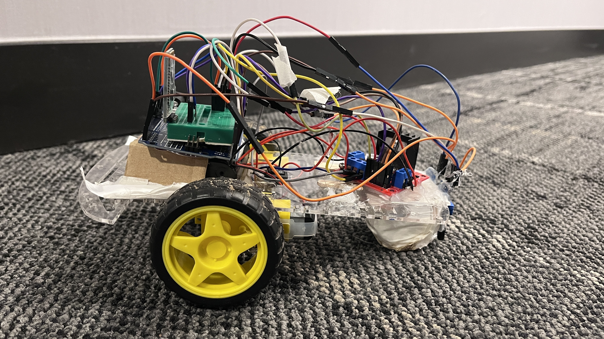
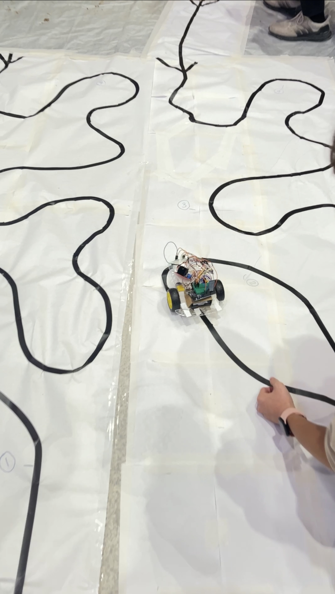

# ALEX-the-Mars-Rover

This Arduino Mars Rover is built for [SEEK 2023 Competition](https://rsx.squarespace.com/seek-2023). We won 2nd place overall amongst 35 teams.

## Side and Top Views of ALEX

## Competition Task 1 Field

## Competition Task 2 Field 

